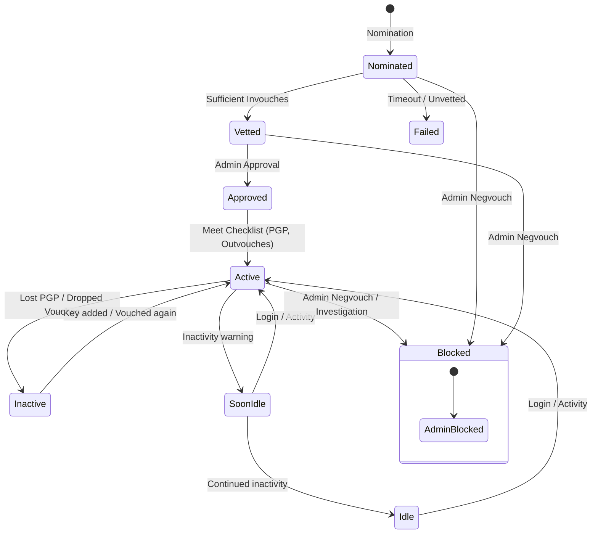

# Trident Codebase Overview

Trident is a **Trusted Information Exchange Toolkit** designed as a modernized, full redesign and rewrite in [Go](https://golang.org/) of the original [Ops-Trust Portal](https://github.com/ops-trust/portal/) software. Its primary purpose is to power highly secure, vetted, trust-based communication communities (such as [Ops-Trust](https://www.ops-trust.net)) where members share sensitive threat intelligence, coordinate incident response, and exchange security notifications.

---

## 1. Core Purpose & High-Trust Model

Unlike generic collaboration systems, Trident assumes a threat model and operational environment where membership is strictly controlled by human-to-human trust. The core value proposition of the toolkit is to manage the lifecycle of this trust-based network through several distinct properties:

- **Vetting-Based Membership**: A new user cannot simply sign up. They must be **Nominated** by an existing active member. To become an active member, they must be **Vouched** for by multiple active members of a specific trust group.
- **Structured Attestations**: Vouches are not simple ratings. A vouch is backed by specific, mandatory assertions (attestations), such as:
  * *"I have met them in person more than once"*
  * *"I trust them to take action"*
  * *"I will share membership fate with them"*
- **Dual-Token Account Recovery (Split Passwords)**: To prevent account-takeover and ensure physical/social verification, resetting a password or setting up a new account requires split-token coordination. One part of the recovery token is sent to the user's registered email; the other part is sent to their **Nominator**. The user must contact their nominator through a trusted out-of-band channel to retrieve the other half of the token to gain account access.

---

## 2. System Architecture

Trident uses a clean, separation-of-concerns architecture. Instead of bundling generic community portal logic with the custom trust-network logic, the core framework has been split into a separate, reusable library project called **Pitchfork** (`trident.li/pitchfork`).

### Architectural Topology

```mermaid
graph TD
    subgraph Client Layer
        TCLI[tcli CLI Client]
        WebUI[Web UI / Browser]
        TSetup[tsetup DB Admin CLI]
    end

    subgraph Application Server (tridentd)
        TriDaemon[tridentd Daemon]
        TriUI[trident.li/trident/src/ui]
        TriLib[trident.li/trident/src/lib]
        
        subgraph Core Framework (pitchfork)
            PfServer[pitchfork/cmd/server]
            PfUI[pitchfork/ui]
            PfLib[pitchfork/lib]
        end
    end

    subgraph Database Layer
        DB[(PostgreSQL Database)]
    end

    TCLI -->|REST API / JWT| TriDaemon
    WebUI -->|HTTP / OAuth2 / OpenID| TriDaemon
    TSetup -->|Direct SQL / Admin| DB
    
    TriDaemon --> PfServer
    TriUI --> PfUI
    TriLib --> PfLib
    
    PfLib -->|SQL Queries| DB
    TriLib -->|Domain SQL Queries| DB
```

### The Pitchfork Extension Design

Trident implements a modular plug-in pattern on top of the Pitchfork framework:
1. **Context Extension (`TriCtx`)**: Trident wraps Pitchfork's `PfCtx` to maintain domain-specific context data, such as the selected vouchee (`TriUser`) during vouching workflows.
2. **User Customization (`TriUser`)**: Adds domain-specific user methods like checking if another user is a valid nominator (`IsNominator`) and discovering the best nominator (`BestNominator`).
3. **Group Customization (`TriGroup`)**: Extends groups to handle complex parameter controls (e.g., min/max inbound and outbound vouches required for active status, inactivity expirations, and nomination settings) and introduces structured attestations.
4. **Vouch Customization (`TriVouch`)**: Implements the data structures and query interfaces mapping vouchors to vouchees within specific trust groups.

---

## 3. Key Core Modules

### User Management & Split Password Flow (`src/lib/user.go`, `src/lib/mail.go`)
Ensures that account creation and password recovery are structurally authenticated by trust chains. When a recovery/setup is triggered (`user_pw_reset`):
1. A random recovery token is split into two halves: the User Portion and the Nominator Portion.
2. **User Portion**: Emailed directly to the target user (`Mail_PassResetUser`).
3. **Nominator Portion**: Emailed to their verified nominator (`Mail_PassResetNominator`).
4. The database stores the combined hash (`SetRecoverToken`). The user can only complete recovery at `/recover/` when they input both parts correctly.

### Trust Groups & Attestations (`src/lib/group.go`, `src/lib/group_attestation.go`)
Trust groups maintain their own specific security parameters. Administrative controls allow each group to define:
- Minimum incoming vouches needed to vet a user.
- Minimum outgoing vouches a user must make to maintain active status.
- The list of customized vouching requirements (attestations).

### Vouching Registry (`src/lib/vouch.go`)
Tracks active and historical vouches. It validates that all required group attestations are satisfied before allowing a vouch to be inserted.

### UI Web & API Routing (`src/ui/`)
Trident provides a clean web interface by overriding and extending the Pitchfork UI menus and handler functions (`TriUIMenuOverride`):
- Renders profile views displaying incoming/outgoing vouches.
- Interfaces directly with the underlying library core via commands (e.g., `group member add`, `group vouch add`).

---

## 4. Member Lifecycle States

Membership is tracked through a fine-grained state machine. The transition table governs member capabilities:



### Member Capabilities Table

| State | Can Login | Can See Directory & Wiki | Can Send Group Mail | Can Recv Group Mail | Blocked | Hidden |
| :--- | :---: | :---: | :---: | :---: | :---: | :---: |
| **Nominated** | False | False | False | False | False | False |
| **Vetted** | False | False | False | False | False | False |
| **Approved** | True | True | False | False | False | False |
| **Active** | True | True | True | True | False | False |
| **Inactive** | True | True | True | False | False | False |
| **Blocked** | False | False | False | False | True | True |
| **Failed** | False | False | False | False | False | True |
| **SoonIdle** | True | True | True | True | False | False |
| **Idle** | True | True | True | False | False | False |

---

## 5. Database Architecture & Migration Strategy

Trident relies heavily on relational integrity and transactional security in PostgreSQL.

- **Data Isolation & DB Grantees**: Database migrations and schema structures are executed as the database owner (`postgres`). The running application user (`trident`) is configured with standard CRUD privileges (`SELECT`, `INSERT`, `UPDATE`, `DELETE`) but cannot modify database schema topology.
- **Transactional Migrations**: Every database migration (located under `share/dbschemas/`) is packaged in standard transactional SQL format:
  ```sql
  BEGIN;
  -- Alterations here
  UPDATE system SET db_version = <new_version>;
  COMMIT;
  ```
  This ensures atomic database state upgrades; any migration failure will automatically roll back changes, preventing database corruption.

---

## 6. Operational & Administrative Core Utilities

Trident provides three specialized binaries and one migration tool in its build setup:

1. **`tridentd` (Daemon)**: The background HTTP/S server. Runs on port `8333` by default. Provides the JSON REST API (with JWT authentication) and the core web portal interface. Designed to be run behind a TLS terminating proxy (like Nginx).
2. **`tcli` (Command Line Client)**: Pronounced *"Tickly"*. Allows full administration and automation by issuing JSON REST API commands directly to `tridentd`. Reads credentials from `~/.trident_token` (customizable using the `TRIDENT_TOKEN` environment variable).
3. **`tsetup` (Database & Admin Setup)**: Staging and schema management CLI utility. Must be executed under database administrative rights (e.g. the `postgres` system user). Used for bootstrapping the DB (`setup_db`), creating initial admins (`adduser`), and performing migrations (`upgrade_db`).
4. **`twikiexport`**: Command-line utility to export historical legacy trust group wikis (like FosWiki) into standard compressed tar archives, which can then be cleanly imported into Trident wikis using `tcli`.
